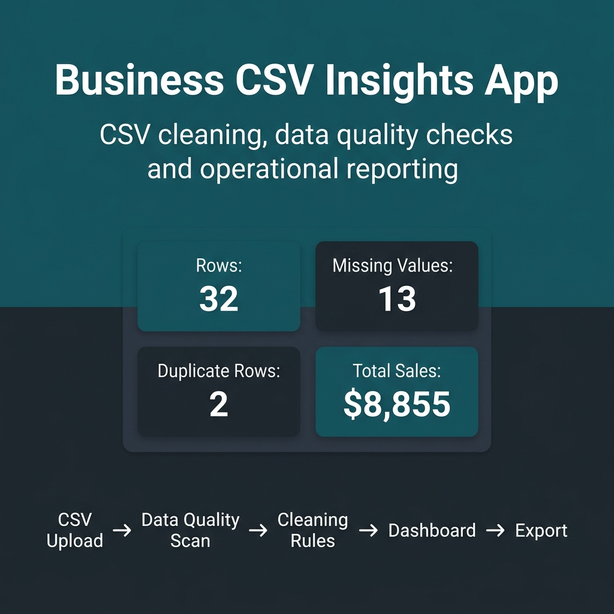
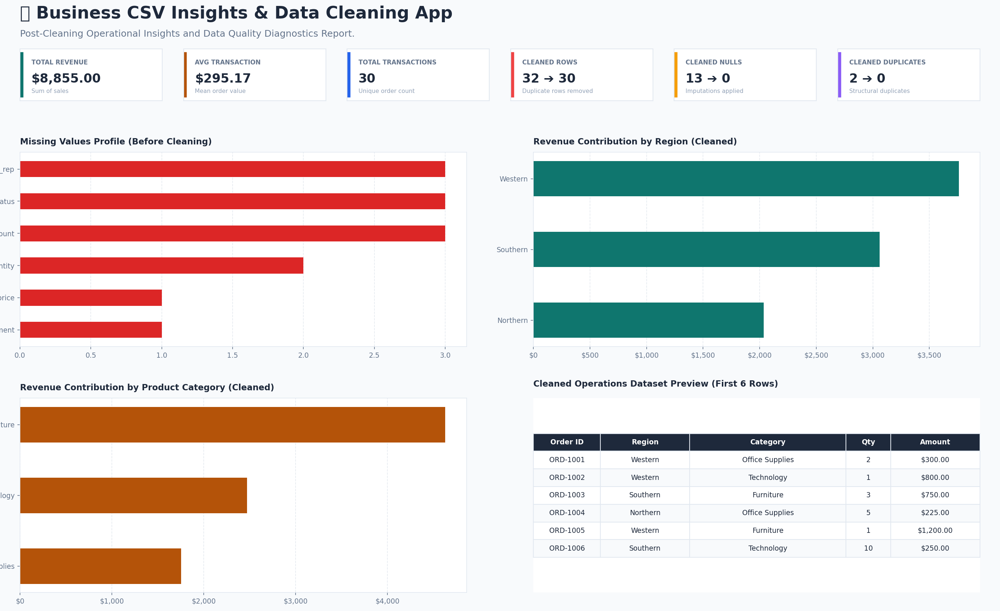

# Business CSV Insights & Data Cleaning App



A business data cleaning and reporting app built to turn messy CSV files into clean datasets, quality checks and operational insights.

The app allows users to upload CSV files, detect missing values and duplicate records, apply cleaning rules, visualize business metrics and export cleaned reporting files.

## What Was Delivered

- CSV upload interface
- Automated data quality scan
- Missing value detection
- Duplicate row detection
- Data cleaning workflow
- Before vs after cleaning summary
- Business KPI dashboard
- Sales and operations charts
- Clean CSV export
- Clean Excel export
- Sample business dataset

## Dashboard Preview



## Project Outcome

The final app helps business users replace manual spreadsheet cleanup with an interactive workflow for data validation, cleaning and reporting.

It is useful for teams that receive messy CSV or Excel exports from sales systems, CRMs, ERPs, marketplaces, logistics tools or operational spreadsheets.

## Key Features

- Upload CSV files
- Load sample business data
- Detect data quality issues
- Remove duplicate rows
- Fill missing values
- Standardize text fields
- Generate sales KPIs
- Visualize operational performance
- Export cleaned CSV and Excel files

## Business Value

This solution helps reduce manual spreadsheet work, improve data quality and accelerate reporting.

It can be adapted for sales reporting, operations tracking, CRM exports, inventory files, marketplace reports, logistics files and recurring Excel/CSV workflows.

## Tech Stack

Python, Streamlit, Pandas, Plotly, OpenPyXL, CSV, Excel

## Freelance Use Cases

This type of project can be adapted for:

- Excel and CSV automation
- Data cleaning workflows
- Sales reporting dashboards
- Operations reporting
- CRM export cleaning
- Marketplace order analysis
- Inventory file validation
- Internal business tools

## Repository Structure

```
business-csv-insights-app/
├── app.py
├── requirements.txt
├── README.md
├── .gitignore
├── assets/
│   ├── project-cover.png
│   ├── dashboard-preview.png
│   └── fiverr_portfolio_text.md
├── sample_data/
│   └── sample_sales_operations.csv
└── src/
    ├── data_loader.py
    ├── data_cleaner.py
    ├── analytics.py
    └── utils.py
```

## How to Run Locally

```powershell
python -m venv .venv
.venv\Scripts\activate
pip install -r requirements.txt
streamlit run app.py
```
